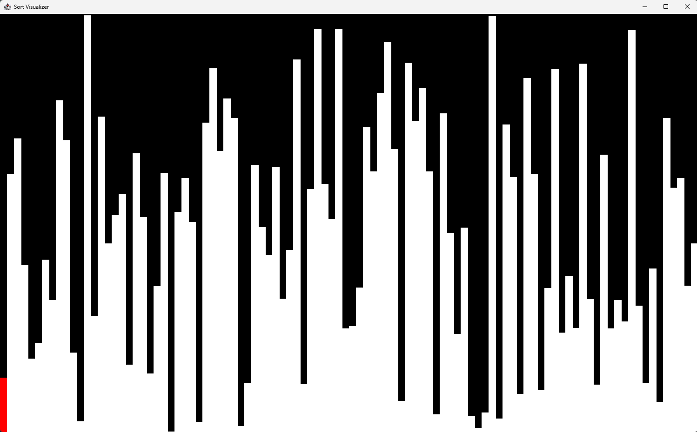
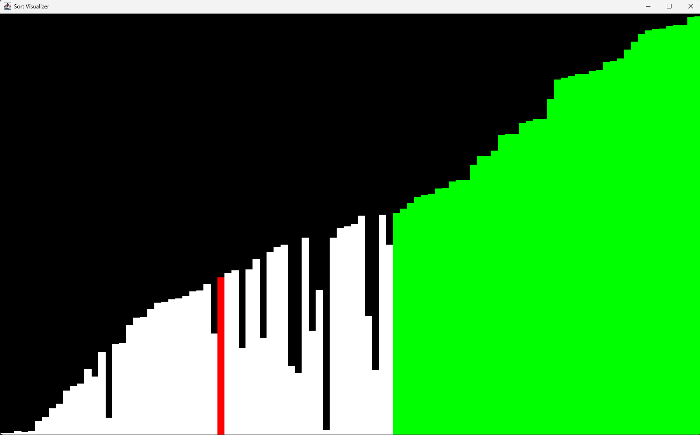
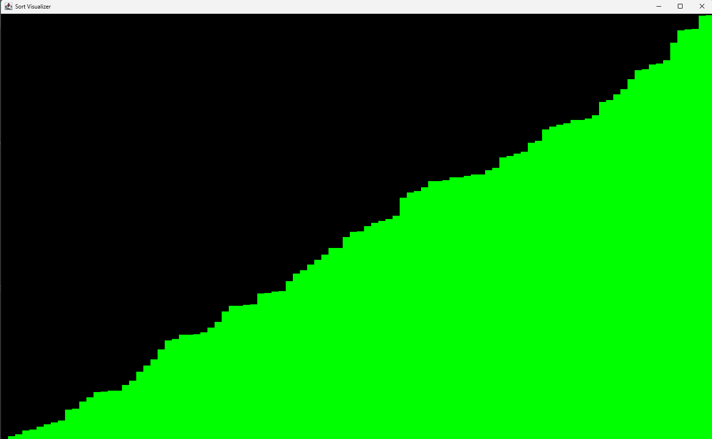

# JFrame Sort Visualizer

A Java Swing (**JFrame**) program that visually presents a sorting algorithm in real time.

## Features

* Easy algorithm implementation
* Random array generation
* Real-time animation
* Easy scalability for data size
* Looks pretty cool

## How to Run

1. Clone the repo
2. Open in any Java IDE of choice - I use eclipse so there are IDE specific files here but your editor should ignore them 
3. Run the main Java class :)

## Preview

## Why I Made It?

I made this because I saw those videos on youtube and it looked cool so i wanted
to try it for myself. 

## Tech Stack

* Java
* Swing / JFrame

I know... crazy stack.
